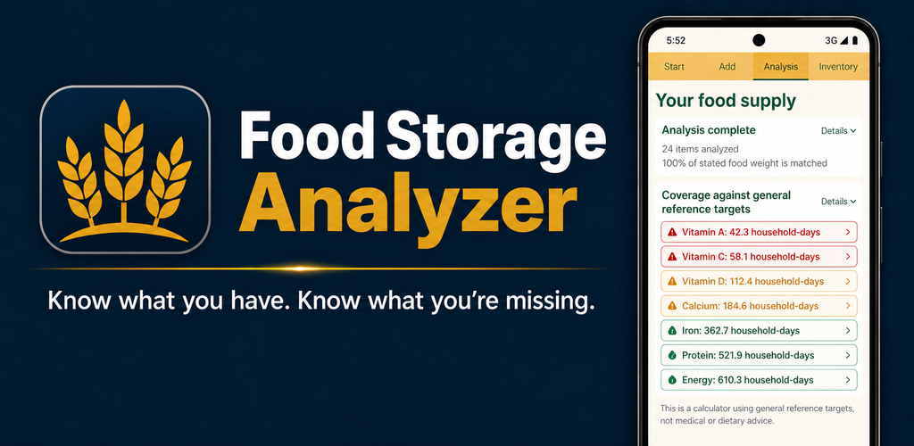
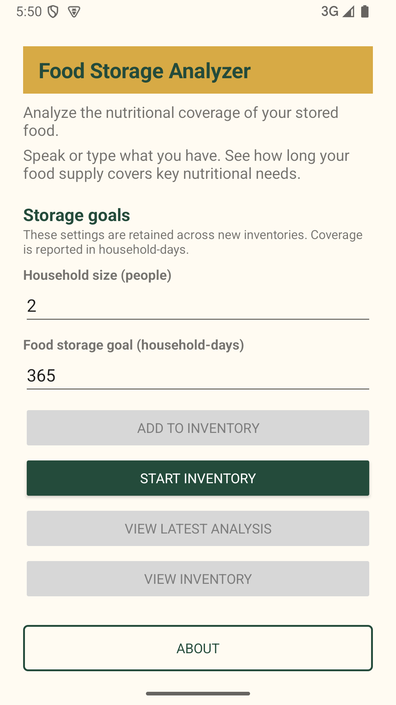
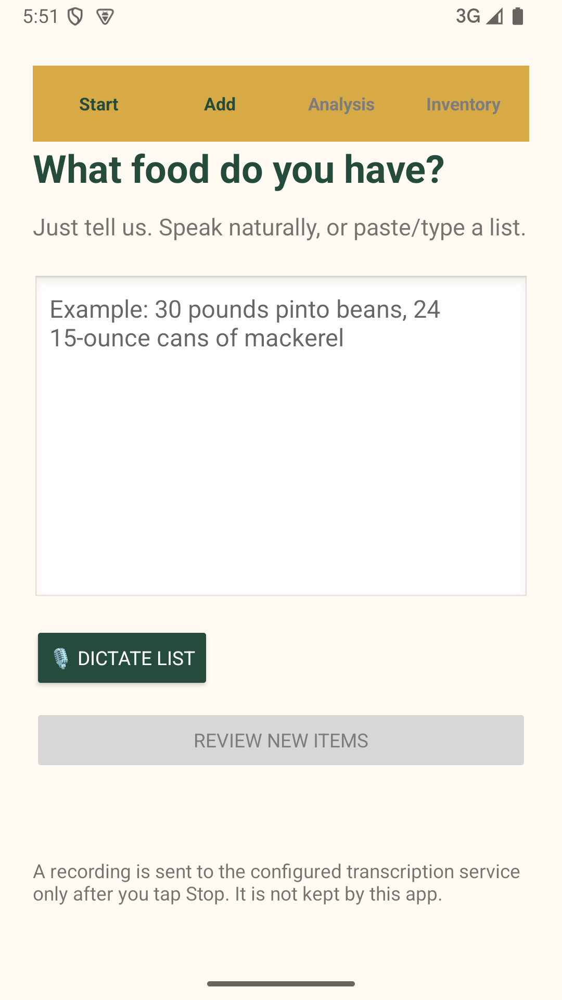
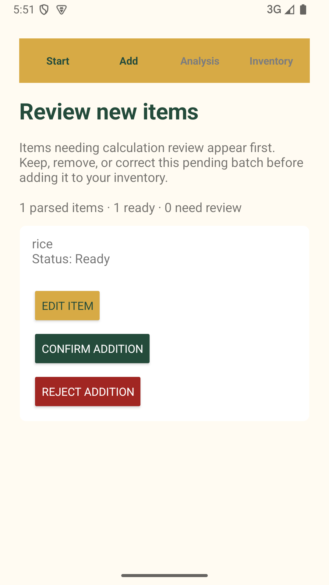
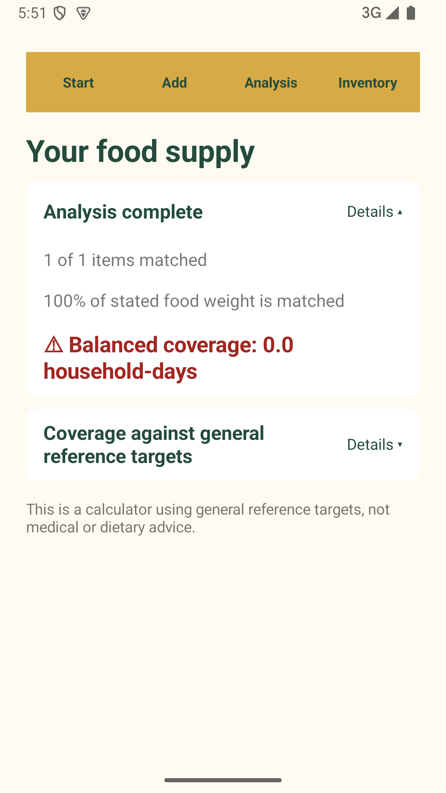
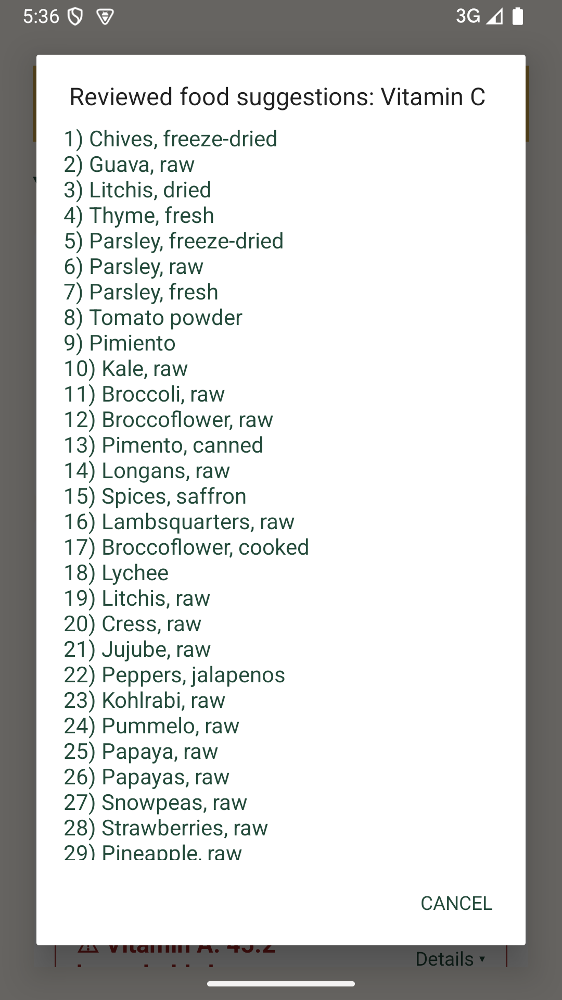
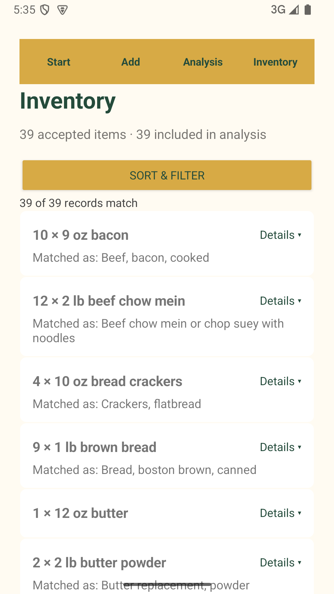

# Food Storage Analyzer

**Status:** 🟢 Production
**Current version:** `2026.09.11-6`

## Overview

Food Storage Analyzer helps you assess the nutritional coverage of stored food.
Speak or type what you have, review the recognized items, and see which
nutritional needs your supply covers—and where the significant gaps are.

The application is designed to provide useful preliminary results even when
some packaged foods still need clarification. Inventory and analysis state are
stored locally on the Android device.

## Features

- Dictate, paste, or type a rough food inventory
- Review and correct recognized inventory items
- Match items to supported generic foods when needed
- Set household size and food-storage goals
- Analyze nutritional coverage in household-days
- Identify major nutritional shortcomings
- Review incomplete or unresolved item information
- Sort and filter the stored inventory
- No account or registration required

## Screenshots

  
  
  
  
  
  

## Repository Purpose

This public repository contains Food Storage Analyzer documentation, release
notes, store graphics, screenshots, and issue-tracking material. It does not
contain the Android application source code.

## Resources

- [Release Notes](docs/release-notes.md)
- [Documentation](docs/README.md)
- [Google Play](https://play.google.com/store/apps/details?id=champagne.engineering.fsa)
- [Food Storage Analyzer product page](https://champagne.engineering/food-storage-analyzer)
- [Privacy Policy](https://champagne.engineering/privacy)
- [Terms of Service](https://champagne.engineering/tos)

## Support

Website: https://champagne.engineering 
Email: support@champagne.engineering

## Important Notice

Food Storage Analyzer provides informational calculations and estimates. It
does not provide medical, nutritional, dietary, emergency-preparedness, or
other professional advice. Results may be incomplete or inaccurate and should
not be the sole basis for decisions affecting health, nutrition, or emergency
preparedness.

## Copyright

© 2026 Champagne Engineering, LLC. All rights reserved.

Food Storage Analyzer is an independent application developed under the CE
Widgets brand by Champagne Engineering, LLC.
